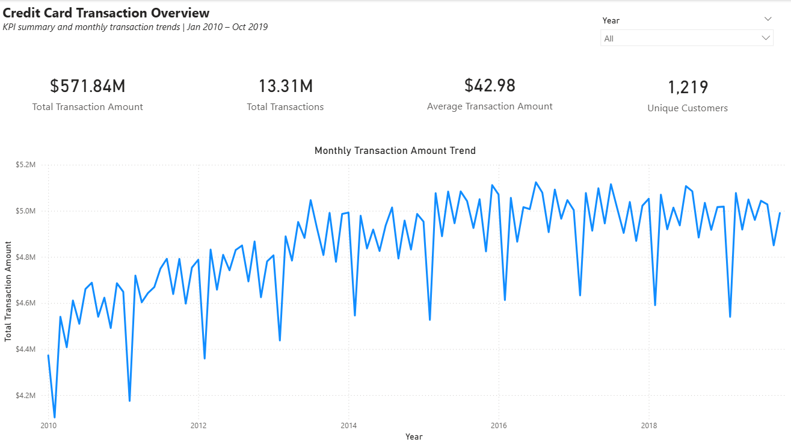
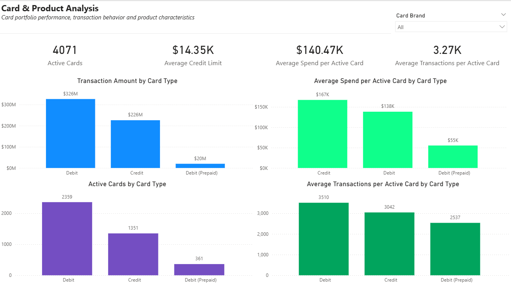
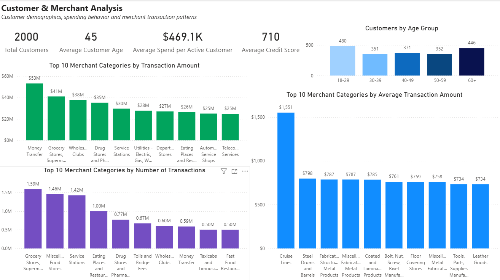
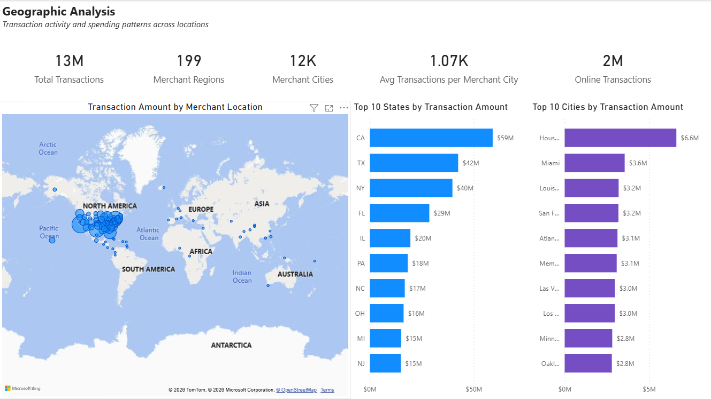

# Credit Card Transaction Analysis | Power BI

## Project Overview

This project analyzes approximately **13.31 million credit card transactions** recorded between **January 2010 and October 2019**, with a total transaction value of approximately **$571.84 million**.

The goal was to transform a large financial dataset into an interactive Power BI reporting solution that provides insights into:

- Overall transaction trends
- Card portfolio performance
- Customer demographics
- Merchant category performance
- Geographic transaction patterns
- Online versus physical transaction activity

The project covers the complete analytical workflow: **data profiling, data cleaning and transformation, data modeling, DAX measure development, exploratory analysis, data-quality investigation, and interactive dashboard creation**.

---

## Dashboard Preview

### 1. Credit Card Transaction Overview




This page provides an executive-level overview of transaction activity and monthly trends.

**Key KPIs:**

- **$571.84M** total transaction amount
- **13.31M** total transactions
- **$42.98** average transaction amount
- **1,219** unique transacting customers

The monthly transaction trend shows growth during the earlier years of the dataset, followed by a more stable pattern. Recurring declines may indicate seasonality, although additional calendar-month analysis would be required to confirm this.

A **Year slicer** allows users to interactively filter the dashboard.

---

### 2. Card & Product Analysis




This page analyzes card portfolio performance across different card types and supports interactive filtering by card brand.

**Key KPIs:**

- **4,071** active cards
- **$14.35K** average credit limit
- **$140.47K** average spend per active card
- **3.27K** average transactions per active card

**Key findings:**

- Debit cards generated approximately **$326M** in transaction value.
- Credit cards generated approximately **$226M**.
- Prepaid debit cards generated approximately **$20M**.
- Debit cards had the largest number of active cards at **2,359**.
- Credit cards generated the highest average spend per active card at approximately **$167K**.
- Debit cards had the highest average transaction frequency per active card at approximately **3,510 transactions**.

This shows that debit dominates overall portfolio activity and transaction frequency, while credit generates greater monetary value per active card.

---

### 3. Customer & Merchant Analysis



This page combines customer demographics with merchant-category performance.

**Customer KPIs:**

- **2,000** customer profiles
- **45** average customer age
- **$469.1K** average spend per active customer
- **710** average credit score

**Customer age distribution:**

- 18–29: **480 customers**
- 30–39: **351 customers**
- 40–49: **371 customers**
- 50–59: **352 customers**
- 60+: **446 customers**

**Merchant insights:**

- **Money Transfer** leads merchant categories by total transaction amount at approximately **$53M**.
- **Grocery Stores and Supermarkets** lead by transaction frequency at approximately **1.59M transactions**.
- **Cruise Lines** have the highest average transaction amount among the displayed categories at approximately **$1,551**.

This analysis demonstrates that total transaction value, transaction frequency, and average transaction size reveal different aspects of merchant performance.

---

### 4. Geographic Analysis



This page analyzes transaction activity across physical merchant locations while representing online transactions separately.

**Key KPIs:**

- **13M** total transactions
- **199** merchant regions
- **12K** merchant cities
- **1.07K** average transactions per merchant city
- **2M** online transactions

**Geographic findings:**

- California leads states by transaction amount at approximately **$59M**.
- Texas follows with approximately **$42M**.
- New York ranks third with approximately **$40M**.
- Houston leads cities by transaction amount at approximately **$6.6M**.

Approximately **2 million transactions** were identified as online transactions. These records typically use:

`merchant_city = "ONLINE"`

and do not have meaningful physical state geography. They were therefore retained in the overall analysis but represented separately from physical geographic rankings.

---

## Key Business Insights

1. **Debit dominates overall portfolio activity.**  
   Debit cards lead in total transaction value, number of active cards, and transaction frequency per active card.

2. **Credit generates greater value per active card.**  
   Credit cards average approximately **$167K per active card**, compared with approximately **$138K for debit cards**.

3. **Transaction value and transaction frequency tell different stories.**  
   Money Transfer leads merchant categories by total transaction amount, while Grocery Stores and Supermarkets lead by transaction count.

4. **Cruise Lines represent a high-value transaction category.**  
   Their average displayed transaction amount is approximately **$1,551**, substantially higher than other leading categories.

5. **Geographic spending is concentrated in major U.S. markets.**  
   California leads states by transaction amount, while Houston leads cities.

6. **Online transactions form a significant independent channel.**  
   Approximately **2 million transactions** lack meaningful physical state geography and are therefore analyzed separately from physical locations.

7. **The customer base spans multiple generations.**  
   The largest age group is **18–29**, while customers aged **60+** also represent a substantial part of the customer base.

---

## Data Preparation & Investigation

A major principle throughout this project was:

> **Investigate unusual values before removing them.**

The data-preparation and investigation process included:

- Reviewing column data types
- Profiling missing and null values
- Investigating negative transaction amounts
- Examining merchant cities and merchant states
- Investigating online transactions without physical geography
- Reviewing international merchant locations
- Investigating unusually high average transaction values
- Validating relationships between transaction, customer, and card data

### Negative Transactions

Negative transaction amounts were retained because they may represent legitimate:

- Refunds
- Reversals
- Corrections
- Returned purchases

Without sufficient evidence that these records were errors, removing them would risk deleting valid financial activity.

### Missing Merchant States & Online Transactions

During geographic analysis, a blank state category initially appeared among the largest categories by transaction amount.

Investigation showed that many records without `merchant_state` had:

`merchant_city = "ONLINE"`

These transactions do not have meaningful physical geography. The final approach was to:

- Retain online transactions in the overall analysis
- Exclude blank state values from physical state rankings
- Represent online activity using a dedicated **Online Transactions** KPI

### International Merchant Locations

International merchant points were not automatically removed because international transaction activity can be legitimate.

Unusual geography alone was not considered sufficient evidence that a record was incorrect.

### Merchant Regions

The source merchant state/region field contains more distinct values than the standard 50 U.S. states because the dataset includes a broader range of geographic values.

The final dashboard therefore uses the broader KPI label:

**Merchant Regions**

The Top 10 States chart focuses on leading recognizable U.S. states.

### High Average Transaction Values

Cruise Lines showed an average transaction amount of approximately **$1,551**.

This value was investigated as a potential anomaly but retained because high-value cruise and travel bookings are commercially plausible.

### Customer Profiles vs Unique Transacting Customers

The report contains:

- **2,000 customer profiles**
- **1,219 unique transacting customers**

These metrics answer different questions.

The first represents all customer profiles available in the customer dataset, while the second represents customers associated with transaction activity in the analyzed transaction table.

---

## Tools & Technologies

| Tool | Purpose |
|---|---|
| **Microsoft Excel** | Initial data profiling and exploratory analysis |
| **Power Query** | Data import, cleaning, transformation, and preparation |
| **Power BI** | Data modeling, dashboard development, and interactive visualization |
| **DAX** | KPI calculations and analytical measures |

---

## Selected DAX Measures

Measures created during the project include:

- Total Transaction Amount
- Total Transactions
- Average Transaction Amount
- Unique Customers
- Active Cards
- Average Credit Limit
- Average Spend per Active Card
- Average Transactions per Active Card
- Average Spend per Active Customer
- Average Customer Age
- Average Credit Score
- Merchant Regions
- Merchant Cities
- Average Transactions per Merchant City
- Online Transactions

Example:

```DAX
Online Transactions =
CALCULATE(
    [Total Transactions],
    Transactions_Clean[merchant_city] = "ONLINE"
)
```

During development, this measure initially appeared blank because an active chart selection was applying additional filter context. After clearing the visual selection, the measure correctly returned approximately **2 million transactions**.

---

## Dataset Source

The dataset used in this project is publicly available on Kaggle:

**Financial Transactions Dataset: Analytics**  
**Author:** computingvictor  
**Platform:** Kaggle  
**Source:** https://www.kaggle.com/datasets/computingvictor/transactions-fraud-datasets

The dataset contains large-scale financial transaction data together with customer and card information.

For this project, the data was used to analyze:

- Transaction trends
- Card portfolio performance
- Customer demographics
- Merchant categories
- Geographic transaction patterns
- Online transaction activity

The full raw dataset is not included in this GitHub repository due to its large size. It can be downloaded directly from the Kaggle source above.

---

## Repository Structure

```text
credit-card-transaction-analysis/
│
├── README.md
├── PROJECT_DOCUMENTATION.md
├── Credit_Card_Transaction_Analysis.pbix
│
├── images/
│   ├── 01_transaction_overview.png
│   ├── 02_card_product_analysis.png
│   ├── 03_customer_merchant_analysis.png
│   └── 04_geographic_analysis.png
│
└── data/
    └── README.md
```

---

## Skills Demonstrated

This project demonstrates practical experience with:

- Data profiling
- Exploratory data analysis
- Microsoft Excel
- Power Query
- Power BI data modeling
- DAX measure development
- KPI design
- Time-series analysis
- Card portfolio analysis
- Customer demographic analysis
- Merchant-category analysis
- Geographic analysis
- Data-quality investigation
- Business interpretation
- Interactive dashboard development
- Technical documentation

---

## Challenges & Solutions

| Challenge | Solution |
|---|---|
| Large transaction dataset | Used Power Query and Power BI to analyze approximately 13.31M records |
| Blank state category | Investigated source records and identified online transactions as a major cause |
| Online activity affecting geographic analysis | Created a separate Online Transactions KPI and excluded blank states from physical rankings |
| International map points | Retained them because international merchant activity can be legitimate |
| Negative transaction values | Preserved them as possible refunds, reversals, or corrections |
| High Cruise Lines average transaction value | Investigated the business context and retained the plausible value |
| DAX measure appeared blank | Identified active visual filtering as the cause |
| Different customer counts | Distinguished total customer profiles from unique transacting customers |
| Temporary investigation page | Documented the investigation but excluded the exploratory page from the final report |

---

## Conclusion

This project demonstrates an end-to-end analytical workflow using **Excel, Power Query, Power BI, and DAX** to transform a large financial dataset into an interactive business intelligence solution.

Beyond dashboard creation, the project emphasizes an important analytical principle:

> **Unexpected values should be investigated in their business context before being classified as errors or removed from the data.**

The final result is a four-page interactive Power BI report covering transaction trends, card portfolio performance, customer demographics, merchant behavior, and geographic transaction activity across approximately **13.31 million financial transactions**.
